# NatiqQuran API Setup Script

<div align="center">

[](https://github.com/NatiqQuran/nq-scripts/blob/main/bash_scripts/install_quran_api.sh)
[](LICENSE)
[](https://www.gnu.org/software/bash/)
[](https://www.docker.com/)

</div>

> 🕌 **Production-ready automated setup for NatiqQuran API with comprehensive security and lifecycle management**

A sophisticated bash script that provides complete installation, configuration, and management of the NatiqQuran API project. Features automatic credential generation, interactive configuration, secure cleanup, and production-ready deployment.

## ✨ Key Features

- 🔐 **Automatic Credential Generation** - Cryptographically secure random passwords
- ✏️ **Interactive Configuration** - Edit generated values before deployment  
- 🐳 **Complete Docker Management** - Installation, updates, and container lifecycle
- 🗄️ **Database Setup** - PostgreSQL with automatic configuration
- 🐰 **Message Queue** - RabbitMQ for background tasks
- 🌐 **Reverse Proxy** - Nginx with customizable settings
- 👤 **Django Superuser** - Automatic admin account creation
- 🔥 **Firewall Security** - UFW automatic configuration
- 🧹 **Secure Cleanup** - Automatic removal of sensitive files
- ☁️ **Cloud Ready** - AWS S3 integration built-in

## 📋 Table of Contents

- [Quick Start](#-quick-start)
- [Installation Methods](#-installation-methods)
- [Usage & Commands](#-usage--commands)
- [Configuration](#-configuration)
- [Commands](#commands)
- [Security Features](#-security-features)
- [Management](#-management)
- [Troubleshooting](#-troubleshooting)
- [Contributing](#-contributing)

## 🚀 Quick Start

### Prerequisites

| Component | Requirement |
|-----------|-------------|
| **OS** | Linux (Ubuntu 18.04+, Debian 9+) |
| **RAM** | 4GB minimum |
| **Storage** | 10GB minimum free space |
| **Network** | Internet connection required |
| **Software** | `curl`, `bash 4.0+`, `sudo` |

### One-Line Installation

```bash
# Direct execution (recommended for quick setup)
curl -fsSL https://raw.githubusercontent.com/NatiqQuran/nq-scripts/main/bash_scripts/install_quran_api.sh | bash
```

## 📦 Installation Methods

<details>
<summary><strong>Method 1: Direct Download & Execute</strong></summary>

```bash
# Download and save locally
curl -fsSL https://raw.githubusercontent.com/NatiqQuran/nq-scripts/main/bash_scripts/install_quran_api.sh -o install_quran_api.sh

# Make executable and run
chmod +x install_quran_api.sh
./install_quran_api.sh
```
</details>

<details>
<summary><strong>Method 2: Git Clone</strong></summary>

```bash
# Clone the repository
git clone https://github.com/NatiqQuran/nq-scripts.git
cd nq-scripts/bash_scripts

# Run installation
./install_quran_api.sh
```
</details>

<details>
<summary><strong>Method 3: Advanced Options</strong></summary>

```bash
# Skip Docker installation
./install_quran_api.sh --no-install

# Skip firewall setup
./install_quran_api.sh --no-firewall

# Enable debug mode
DEBUG=1 ./install_quran_api.sh --debug
```
</details>

## 🎯 Usage & Commands

### Core Commands

| Command | Description | Use Case |
|---------|-------------|----------|
| `install` (default) | Complete fresh installation | First-time setup |
| `restart` | Restart all services | After configuration changes |
| `update` | Pull latest images and restart | Regular updates |

### Command Options

| Option | Description | Example |
|--------|-------------|---------|
| `--no-install` | Skip Docker installation | `bash install_quran_api.sh --no-install` |
| `--no-firewall` | Skip firewall configuration | `bash install_quran_api.sh --no-firewall` |
| `--debug` | Enable detailed logging | `bash install_quran_api.sh --debug` |
| `--help` | Show help information | `bash install_quran_api.sh --help` |
| `--version` | Show script version | `bash install_quran_api.sh --version` |

### Installation Workflow

```mermaid
graph TD
    A[Start Installation] --> B[System Check]
    B --> C[Docker Setup]
    C --> D[Firewall Config]
    D --> E[Download Files]
    E --> F[Generate Credentials]
    F --> G{Edit Config?}
    G -->|Yes| H[Interactive Editor]
    G -->|No| I[Create Production Config]
    H --> I
    I --> J[Process Nginx]
    J --> K[Start Containers]
    K --> L[Create Superuser]
    L --> M[Secure Cleanup]
    M --> N[✅ Complete]
```



## ⚙️ Configuration

### Automatic Environment Generation

The script creates a `.env` file with secure, randomly generated values:

#### Database Configuration
```bash
POSTGRES_USER=user_<8_random_chars>
POSTGRES_PASSWORD=<20_random_chars>
DATABASE_USERNAME=user_<8_random_chars>  # Same as POSTGRES_USER
DATABASE_PASSWORD=<20_random_chars>      # Same as POSTGRES_PASSWORD
```

#### Message Queue & Celery
```bash
RABBIT_USER=rabbit_<8_random_chars>
RABBITMQ_PASS=<20_random_chars>
CELERY_BROKER_URL=amqp://<user>:<pass>@rabbitmq:5672//
```

#### Django Settings
```bash
SECRET_KEY=<50_random_chars>
DJANGO_ALLOWED_HOSTS=<auto_detected_public_ip>
DEBUG=0
FORCED_ALIGNMENT_SECRET_KEY=<50_random_chars>
```

#### Cloud Storage (AWS S3)
```bash
AWS_ACCESS_KEY_ID=example123              # Edit as needed
AWS_SECRET_ACCESS_KEY=secretExample       # Edit as needed  
AWS_S3_ENDPOINT_URL=https://example.com   # Edit as needed
```

#### Nginx & Superuser
```bash
NGINX_CLIENT_MAX_BODY_SIZE=10M
DJANGO_SUPERUSER_USERNAME=admin_<8_random_chars>
DJANGO_SUPERUSER_PASSWORD=<20_random_chars>
DJANGO_SUPERUSER_EMAIL=example@gmail.com  # Edit as needed
```

### Interactive Configuration

During installation, you can:
1. **View generated values** in the `.env` file
2. **Edit any settings** using your preferred editor (nano/vim/vi)
3. **Customize AWS credentials** for your S3 storage
4. **Modify Nginx settings** for your needs

## 📚 Commands

### `install` (Default)
Performs a complete installation and setup:

```bash
bash install_natiq_api.sh [OPTIONS]
```

**Options:**
- `--no-install`: Skip Docker installation
- `--no-firewall`: Skip firewall setup

**Process:**
1. System requirements check
2. Docker installation (if needed)
3. Firewall configuration
4. Download configuration files
5. Generate `.env` file with random credentials
6. Interactive editing (optional)
7. Create production configuration
8. Process Nginx configuration
9. Start Docker containers
10. Wait for services to be ready
11. Create Django superuser
12. Secure cleanup of `.env` file

### `restart`
Restarts all services:

```bash
bash install_natiq_api.sh restart
```

**Process:**
1. Check for existing `.env` file
2. Create `.env` interactively if missing
3. Stop all services
4. Create new production configuration
5. Process Nginx configuration
6. Start containers
7. Cleanup `.env` file (if created during operation)

### `update`
Updates to the latest images and restarts:

```bash
bash install_natiq_api.sh update
```

**Process:**
1. Check for existing `.env` file
2. Create `.env` interactively if missing
3. Stop all services
4. Pull latest Docker images
5. Create new production configuration
6. Process Nginx configuration
7. Start containers
8. Cleanup `.env` file (if created during operation)


## 🔒 Security Features

### Credential Generation
- **Algorithm**: Uses OpenSSL rand with fallback to /dev/urandom and SHA256
- **Strength**: 20-character passwords, 50-character secret keys
- **Randomness**: Cryptographically secure random generation

### File Security
- **Permissions**: 600 (owner read/write only) for sensitive files
- **Secure Deletion**: Uses `shred` command with 3-pass overwrite
- **Automatic Cleanup**: Removes `.env` and temporary files after use
- **No Logging**: Passwords never appear in system logs

### Network Security
- **UFW Firewall**: Configured with secure defaults
- **Port Management**: Only HTTP (80), HTTPS (443), and SSH (22) opened
- **SSL/TLS Ready**: Nginx configured for HTTPS deployment

### Security Best Practices

> ⚠️ **Production Security Checklist**:
> - [ ] Change default AWS credentials
> - [ ] Update superuser email address  
> - [ ] Enable HTTPS with valid SSL certificates
> - [ ] Use strong, unique passwords
> - [ ] Regularly update Docker images
> - [ ] Monitor access logs

## 📁 Project Structure

After successful installation:

```
quran-api/
├── docker-compose.source.yaml    # Main Docker Compose configuration
├── nginx.conf                    # Nginx reverse proxy settings
└── logs/                         # Container logs (auto-created)
```

**Temporary Files** (auto-removed):
- `.env` - Environment variables (🔒 securely deleted)
- `docker-compose.prod.yaml` - Production config

## 🌐 Access Information

After successful installation:

| Service | URL | Credentials |
|---------|-----|-------------|
| **API Endpoint** | `http://YOUR_SERVER_IP` | Public access |
| **Swagger UI** | `http://YOUR_SERVER_IP/api/schema/swagger-ui/` | Public access |
| **Admin Panel** | `http://YOUR_SERVER_IP/admin/` | Auto-generated (shown during install) |

> 💡 **Tip**: Credentials are displayed once during installation. Save them securely!

## 🛠️ Management

### Service Management

```bash
# View real-time logs
docker compose -f quran-api/docker-compose.source.yaml logs -f

# Check container status  
docker compose -f quran-api/docker-compose.source.yaml ps

# Stop all services
docker compose -f quran-api/docker-compose.source.yaml down

# Restart services (preserves data)
./install_quran_api.sh restart

# Update to latest version
./install_quran_api.sh update
```

### Health Checks

```bash
# Database connectivity
docker compose -f quran-api/docker-compose.source.yaml exec postgres-db pg_isready -U postgres

# API health check
curl http://YOUR_SERVER_IP/health/

# Container resource usage
docker stats
```

## 🐛 Troubleshooting

### Common Issues

<details>
<summary><strong>🔴 Docker Installation Fails</strong></summary>

**Symptoms**: Script fails during Docker setup

**Solutions**:
```bash
# Check system compatibility
uname -a && cat /etc/os-release

# Manual Docker installation
curl -fsSL https://get.docker.com -o get-docker.sh
sudo sh get-docker.sh

# Skip Docker install in script
./install_quran_api.sh --no-install
```
</details>

<details>
<summary><strong>🔴 Permission Denied Errors</strong></summary>

**Symptoms**: Docker commands fail with permission errors

**Solutions**:
```bash
# Add user to docker group
sudo usermod -aG docker $USER

# Refresh group membership (logout/login required)
newgrp docker

# Test Docker access
docker run hello-world
```
</details>

<details>
<summary><strong>🔴 Containers Won't Start</strong></summary>

**Symptoms**: Services fail to start or crash immediately

**Solutions**:
```bash
# Check available resources
df -h && free -h

# Check port conflicts
netstat -tuln | grep -E ':80|:443|:5432'

# View detailed container logs
docker compose -f quran-api/docker-compose.source.yaml logs

# Check Docker daemon
systemctl status docker
```
</details>

<details>
<summary><strong>🔴 Cannot Access Admin Panel</strong></summary>

**Symptoms**: Admin panel returns 404 or connection refused

**Solutions**:
```bash
# Check firewall status
sudo ufw status

# Verify containers are running
docker compose -f quran-api/docker-compose.source.yaml ps

# Check Django container logs
docker compose -f quran-api/docker-compose.source.yaml logs natiq-api

# Test local connectivity
curl http://localhost/admin/
```
</details>

<details>
<summary><strong>🔴 Database Connection Issues</strong></summary>

**Symptoms**: API returns database connection errors

**Solutions**:
```bash
# Check PostgreSQL container
docker compose -f quran-api/docker-compose.source.yaml exec postgres-db pg_isready

# View database logs
docker compose -f quran-api/docker-compose.source.yaml logs postgres-db

# Restart database only
docker compose -f quran-api/docker-compose.source.yaml restart postgres-db
```
</details>

### Debug Mode

Enable comprehensive logging for troubleshooting:

```bash
# Full debug installation
DEBUG=1 ./install_quran_api.sh --debug

# Debug restart
DEBUG=1 ./install_quran_api.sh restart
```

## 🤝 Contributing

We welcome contributions! Here's how to get started:

### Development Setup
```bash
# Fork and clone
git clone https://github.com/your-username/nq-scripts.git
cd nq-scripts

# Create feature branch
git checkout -b feature/your-feature-name

# Test your changes
bash -n bash_scripts/install_quran_api.sh
DEBUG=1 ./bash_scripts/install_quran_api.sh
```

## 📞 Support & Community

### Getting Help

- 📖 **Documentation**: This README and inline script comments
- 🐛 **Bug Reports**: [GitHub Issues](https://github.com/NatiqQuran/quran-api/issues)
- 📧 **Email**: Contact development team for enterprise support

### Useful Resources

- [NatiqQuran API Documentation](https://github.com/NatiqQuran/quran-api)
- [Docker Official Documentation](https://hub.docker.com/r/natiqquran/nq-api)
- [Django Project Documentation](https://docs.djangoproject.com/)
- [Nginx Configuration Guide](https://nginx.org/en/docs/)

---

<div align="center">

**Made with ❤️ by the NatiqQuran Development Team**

[](https://github.com/NatiqQuran/quran-api/stargazers)
[](https://github.com/NatiqQuran/quran-api/network/members)

[🌟 Star on GitHub](https://github.com/NatiqQuran/quran-api) • [🐛 Report Issues](https://github.com/NatiqQuran/quran-api/issues) • [💡 Request Features](https://github.com/NatiqQuran/quran-api/issues/new)

*Last Updated: 2025*

</div>
